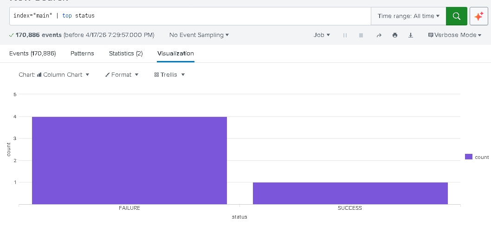

\# 🛡️ SIEM \& Threat Detection Lab

A local security laboratory designed to simulate and monitor brute-force attacks using Python and Splunk Enterprise.

\## 🎯 Project Goal

The objective of this lab was to build a functional \*\*Security Operations Center (SOC)\*\* pipeline. I wanted to understand how raw system events are transformed into actionable security intelligence.

\## 🧰 The Tech Stack

\* \*\*Language:\*\* Python 3.x (Log Generation)

\* \*\*SIEM:\*\* Splunk Enterprise (Data Indexing \& Visualization)

\* \*\*OS:\*\* Windows 10/11

\## 🛠️ How it Works

1\. \*\*Simulation:\*\* The `attack\_sim.py` script mimics an attacker attempting to guess a password. It generates a stream of `FAILURE` events followed by a `SUCCESS` event.

2\. \*\*Ingestion:\*\* Splunk monitors the `\\logs` directory in real-time.

3\. \*\*Detection:\*\* I utilized Splunk Processing Language (SPL) to visualize the attack patterns.

\## 📊 Visualizing the Attack

Below is the distribution of authentication attempts captured during the simulation:

\* \*\*Failure (Purple):\*\* Represents the brute-force attempts.

\* \*\*Success (Pink):\*\* Represents the point of entry.

