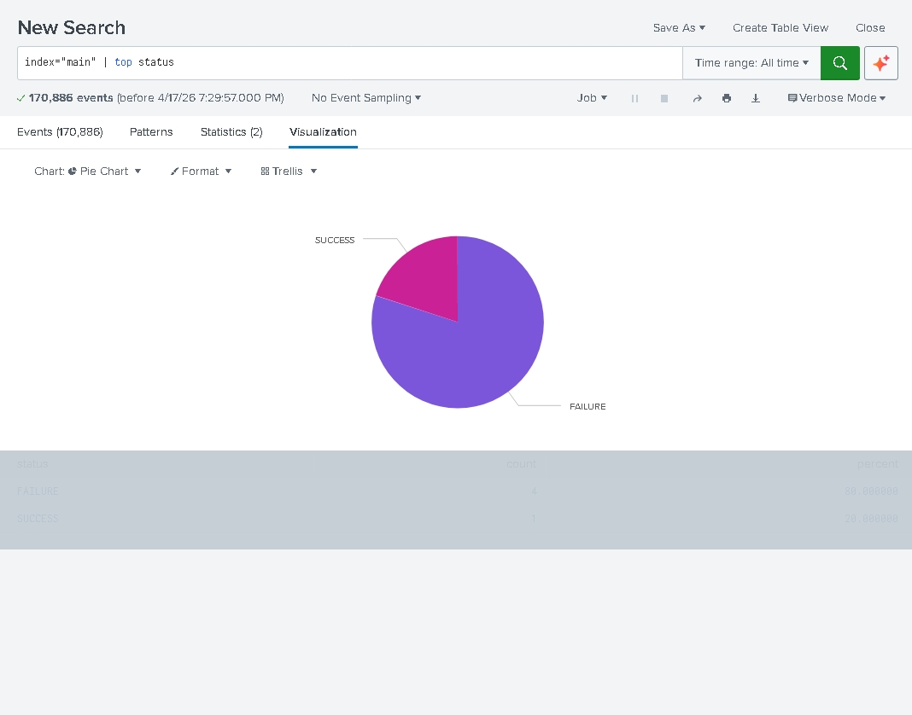

🛡️ SIEM Lab: Catching a Brute-Force Attack

I built this project because I wanted to see exactly how a Security Analyst "catches" a hacker in real-time. Instead of just reading about security, I decided to build a mini-SOC (Security Operations Center) on my own computer.

🧐 What’s going on here?

Basically, I created a "Burglar Alarm" for my PC. I wrote a Python script that acts like a thief trying to guess a password over and over (this is called a Brute-Force attack).

While the script was running, I used Splunk Enterprise to act as the security guard. I pointed Splunk at my log files, and it turned all that messy text into a dashboard that shows exactly when someone was trying to break in.

🛠️ The Tech I Used

Python: To simulate the "attack" and write the logs.

Splunk: To watch the logs and build the charts.

Windows Terminal: Where I spent way too much time debugging file paths!

🐍 How it Works

1\. *Simulation:* The `attack\_sim.py` script mimics an attacker attempting to guess a password. It generates a stream of `FAILURE` events followed by a `SUCCESS` event.

2\. *Ingestion:* Splunk monitors the `\\logs` directory in real-time.

3\. *Detection:* I utilized Splunk Processing Language (SPL) to visualize the attack patterns.

📊 Visualizing the Attack

Below is pie chart is that shows the ratio of failed logins (the purple slices) versus the one time the "attacker" actually got in (the pink slice).

*Failure (Purple):* Represents the brute-force attempts.

*Success (Pink):* Represents the point of entry.

